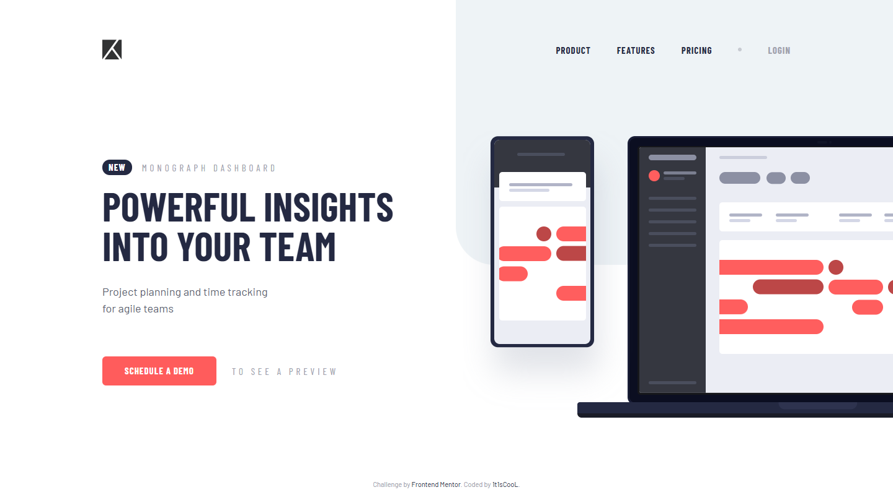
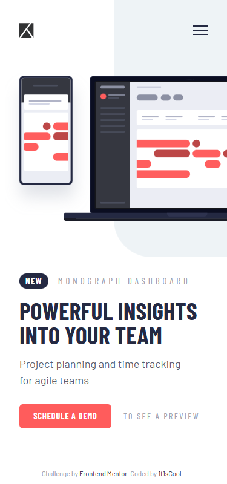

# Frontend Mentor - Project tracking intro component solution

This is a solution to the [Project tracking intro component challenge on Frontend Mentor](https://www.frontendmentor.io/challenges/project-tracking-intro-component-5d5b6ed6a32ba60999e1e5c9). Frontend Mentor challenges help you improve your coding skills by building realistic projects.

## Table of contents

- [Overview](#overview)
    - [The challenge](#the-challenge)
    - [Screenshot](#screenshot)
    - [Links](#links)
- [My process](#my-process)
    - [Built with](#built-with)
    - [What I learned](#what-i-learned)
    - [Continued development](#continued-development)
    - [Useful resources](#useful-resources)
- [Development](#development)
- [Author](#author)

## Overview

### The challenge

Users should be able to:

- View the optimal layout for the site depending on their device's screen size (375px / 1440px designs, responsive from 320px)
- See hover states for all interactive elements on the page
- Create the background shape using code

### Screenshot

| Desktop                              | Mobile                             |
| ------------------------------------ | ---------------------------------- |
|  |  |

### Links

- Solution URL: [Vercel](https://project-tracking-intro-component-ma-five.vercel.app/)
- Live Site URL: [mmalabugin.ru/ProjectTracking](https://mmalabugin.ru/ProjectTracking/)

## My process

### Built with

- Semantic HTML5 markup
- CSS custom properties and Flexbox
- [Preact](https://preactjs.com/) 10 + [Vite](https://vite.dev/) 7 — React syntax at ~4KB runtime; the only state is a `useState` boolean for the mobile menu
- Local Barlow & Barlow Condensed woff2 subsets with `font-display: optional` and `<link rel="preload">` to avoid font-swap layout shift
- The background shape built with code: a `::before` pseudo-element pinned to the top-right corner (`width: calc(50vw - 15px)`, `height: 428px`, `border-bottom-left-radius: 62px`) — the radius was recovered by fitting a circle to the design's curve pixels
- Pixel-perfect layout: page screenshots were compared against the design JPGs with canvas pixel scans — every anchor (logo, nav links, NEW pill, both heading lines, paragraph, button, illustration phone/laptop, menu card items) was measured on both images and nudged until it hit 0±1px on the 1440px and 375px designs, including the open mobile-navigation state

### What I learned

- Vite replaces `%BASE_URL%` anywhere in `index.html`, including inline `<style>` blocks — so the `@font-face` rules can live there and the `preload` URL matches the font src byte-for-byte at both `/` (Vercel) and `/ProjectTracking/` (self-hosted). No JS or CSS-url() interpolation tricks needed.
- The devices illustration is used at its **natural size (960×464) on desktop** and at exactly **52.5% (504px) on mobile** — both derivable from the phone frame in the SVG (341px tall) vs its height in the mockups (341px / 179px). It hangs off the right edge, so the page needs `overflow-x: clip`, not `hidden`, to avoid creating a scroll container.
- An element with the `hidden` attribute stops being hidden the moment any CSS sets its `display` — the mobile menu needed an explicit `.mobile-menu[hidden] { display: none }` companion rule.
- The starter HTML says "to see a **live** preview" but both design JPGs render "TO SEE A PREVIEW" — pixel-perfect means following the design, not the copy deck.
- The hamburger (24×16) and close (20×20) icons have different widths; without a fixed-width flex wrapper on the toggle button the close icon drifts 2px right of where the design centers it.
- The CTA row's letter-spaced caption is 15px/5px tracking on desktop but 14px/2.5px on mobile — scaling only the font-size leaves it ~20px too wide and it wraps.

### Continued development

- Trap focus inside the open mobile menu and return it to the toggle on close — Escape/outside-click closing is already in, a full focus trap is the next accessibility step.
- Wire the "Schedule a demo" CTA to a real form with validation instead of a placeholder link.
- Try container queries instead of the viewport media query so the component adapts when embedded in a narrower layout.

### Useful resources

- [google-webfonts-helper](https://gwfh.mranftl.com/fonts) — self-hosted woff2 subsets of Barlow / Barlow Condensed without manual subsetting.
- [Vite: Env Variables in HTML](https://vite.dev/guide/env-and-mode.html#html-constant-replacement) — the `%BASE_URL%` replacement that keeps font preload URLs and `@font-face` sources identical on any base path.
- [MDN: prefers-reduced-motion](https://developer.mozilla.org/en-US/docs/Web/CSS/@media/prefers-reduced-motion) — respecting the user's motion preference for the hover transitions.
- [Preact hooks](https://preactjs.com/guide/v10/hooks/) — `useState`/`useEffect`/`useRef` used for the mobile menu state and its document-level listeners.

## Development

```bash
npm install
npm run dev     # http://localhost:5173
npm run build   # tsc + vite build → dist/
```

Deploy convention: `main` targets Vercel (the `base` line in `vite.config.ts` stays commented). The `deploy` branch enables `base: '/ProjectTracking/'` and is built by Jenkins into a Docker image (nginx) deployed to Kubernetes behind the shared Traefik ingress (`ingresses` repo).

## Author

- Website - [mmalabugin.ru](https://mmalabugin.ru/)
- Frontend Mentor - [@1t1sCooL](https://www.frontendmentor.io/profile/1t1sCooL)
- Twitter - [@vi_el_mar](https://www.twitter.com/vi_el_mar)
- Telegram - [@ItIsCooL](https://t.me/ItIsCooL)
